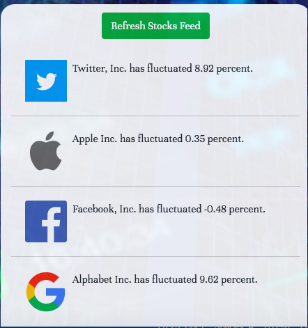
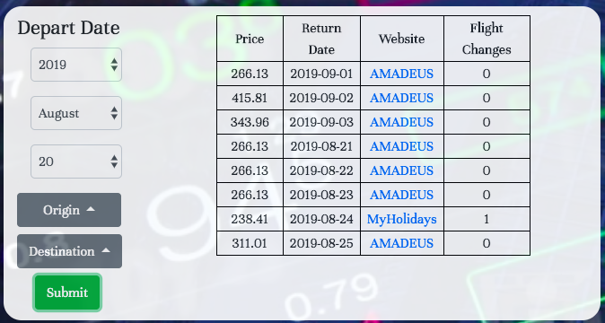

# Finfo

Finfo is a single source of consolidated information on stock prices, travel options, and currency exchange rates. It incorporates user authentication, and allows an account to store their favorite stocks. They can also browse flights from selected cities, and check out currency exchange rates.

## How To
1. If you're new to Finfo, make sure to sign up for an account. 

2. Save a stock by entering its name and ticker 

3. Check your saved stocks at any point. 

4. Click refresh feed to see how much they've fluctuated today. 

5. Explore available flights (within the provided parameters, of course)

6. Planned out your trip? Don't forget to check how expensive the currency transition will be. 

## Technologies Used
* [JQuery](https://jquery.com/) - Javascript library that allows for easier DOM manipulation
* [Firebase Authentication](https://firebase.google.com/docs/auth) - Secure service for user logins
* [World Trading Data API](https://www.worldtradingdata.com/) - API for live stock updates
* [Travel Payouts API](https://support.travelpayouts.com/hc/en-us/categories/200358578-API-documentations) - API for airplane price information
* Javascript
* HTML
* CSS

## Contributors 

### Greyson Gerhard-Young
[LinkedIn](https://www.linkedin.com/in/greyson-gerhard-young/)

### Megha Prasad
[LinkedIn](https://www.linkedin.com/in/megha-bindiganavale/)

### Adam Lehrer
[LinkedIn](https://www.linkedin.com/in/adam-lehrer-968731b5/)

### Raghav Shiv
[LinkedIn](https://www.linkedin.com/in/raghav-shiv/)
